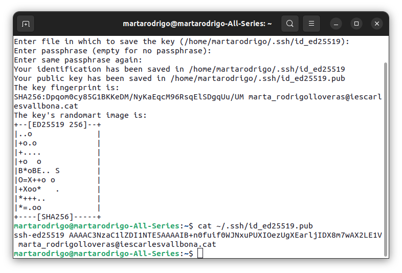
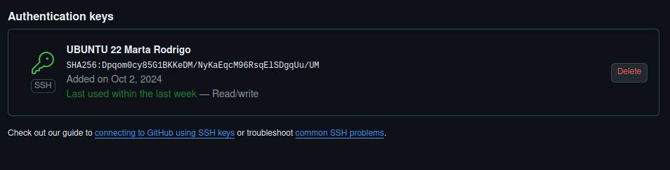
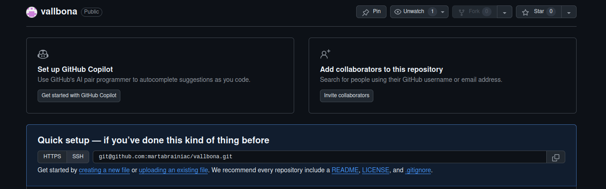
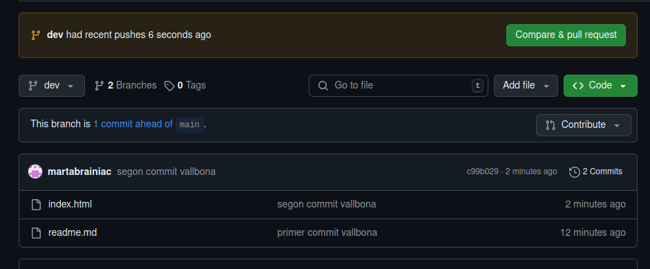
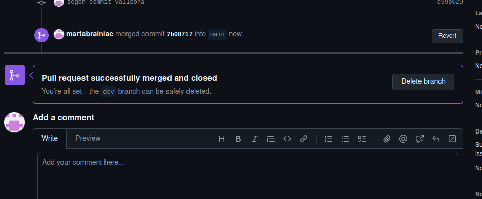
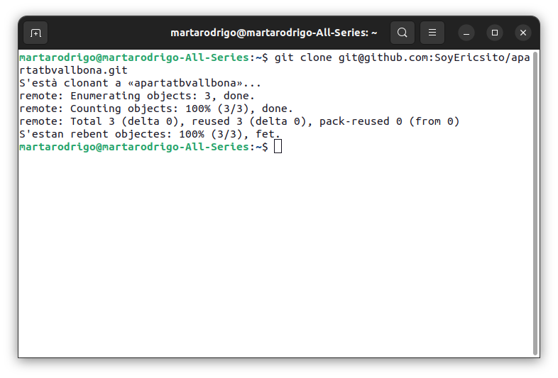
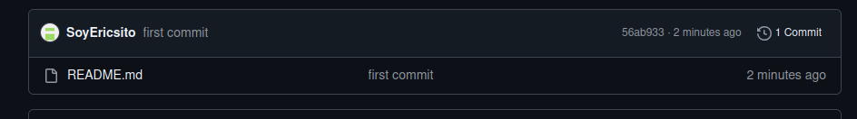
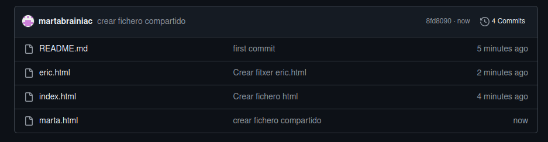

## EXERCICIS MARTA RODRIGO
## EX 1


## EX 2

## EX 3


per crear el repositori:
```sh
Git init vallbona
```
per crear la branca 
```sh
git switch -c main
```
per crear el fitxer
```sh
touch readme.md 
```
per pujar al stage
```sh
git add . 
```
Per fer commit:
```sh
git commit -m "primer commit vallbona"
```
 Per pujar-ho en remot:
 ```sh
 git remote add origin git@github.com:martabrainiac/vallbona.git
git branch -M main
git push u origin main
 ```

## EX 4
per crear la branca 
```sh
git switch -c dev
```
per pujar la branca dev
```sh
git push -u origin dev
```
## EX 5
per crear el fitxer
```sh
Touch index.html
```
per afegir els cavis
```sh
git add .  
```
 per fer commit
```sh
git commit -m "segon commit vallbona"  
```
per pujar-ho tot
```sh

git push  
```

## EX 6

## EX 7

## EX 8
## EX 9
## EX 10

# EX 11

## EX 12
